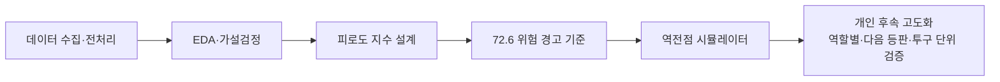
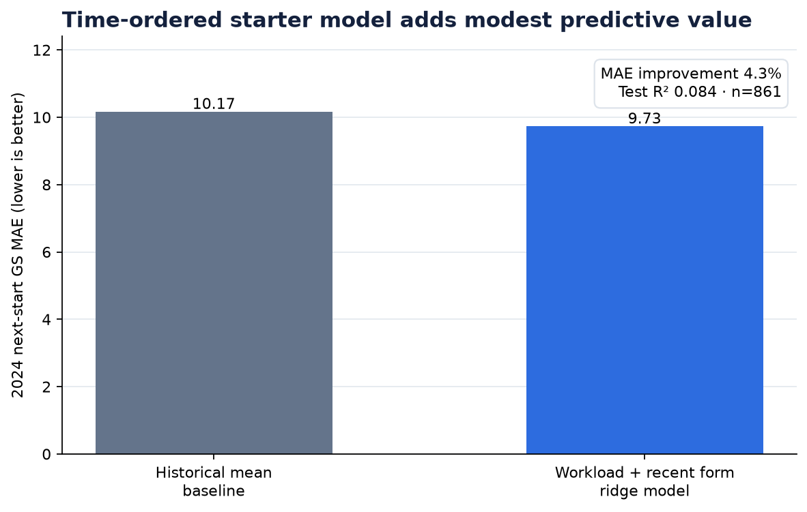
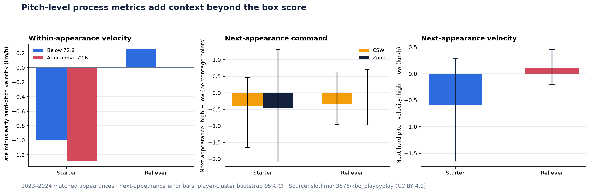

# 피로도 지수로 설계하는 최적의 투수 교체 가이드라인 제시

[](https://github.com/jinwon25/KBO-pitcher-fatigue/actions/workflows/ci.yml)

KBO 투수의 workload를 피로도 지수로 정량화하고, 교체·휴식 판단을 지원하는 방법을 제안한 제4회 중앙대학교 데이터 분석 학회 DArt-B 학술제 대상 수상 프로젝트입니다.

이 저장소는 학술제에서 발표한 분석 흐름과 결과를 중심에 두고, 이후 개인적으로 진행한 역할별 분석, 다음 등판 검증, 시간 순서 기반 예측 실험, 재현성 개선을 하나의 연속된 프로젝트로 기록합니다.



## 프로젝트 개요

| 항목 | 내용 |
|---|---|
| 분석 주제 | KBO 투수 피로도 지수 설계와 교체 의사결정 가이드 제안 |
| 학술제 분석 | 2025.04~2025.05 |
| 개인 후속 분석 | 재현성·역할별·시계열 고도화 |
| 팀 | 중앙대학교 데이터 분석 학회 DArt-B 5기 “최강이세용”, 5인 |
| 본인 역할 | EDA · 데이터 전처리 · 모델링 · 결과 해석 및 시각화 (기여도 40%) |
| 수상 | 제4회 DArt-B 학술제 대상 ([상장](./docs/상장.jpg)) |
| 데이터 범위 | 2020-05-05~2024-10-01 · 17,528행 · 163명 · 선발/불펜 |
| 현재 산출물 | [분석 노트북](./notebooks/analysis.ipynb) · [모니터링 앱](./app/역전점_앱.py) · [재현 지표](./reports/metrics.json) |

## 학술제 분석

### 1. 문제 정의

투수 교체 타이밍은 여전히 현장의 감과 직관에 크게 의존합니다. 얕은 선수층에서 특정 투수에게 등판이 집중되면 반복 출전과 회복 부족이 경기력과 선수 관리에 영향을 줄 수 있습니다.

팀은 피로를 다음과 같이 조작적으로 정의했습니다.

> 투구 활동의 누적량과 강도가 증가함에 따라 투수의 경기력이 유의미하게 저하된 상태

이를 바탕으로 세 가지 질문을 설정했습니다.

1. 투수 피로도에 영향을 미치는 주요 변수는 무엇인가?
2. 피로 누적은 어떤 맥락에서 자주 발생하는가?
3. 피로도를 수치화할 때 핵심적으로 작용하는 변수는 무엇인가?

### 2. 데이터 수집과 전처리

MYKBO·스탯티즈·KBO 공식 사이트·기상 정보를 결합해 선수 기본 정보, 경기 기록, 구종, 구속, 연투·휴식, 이동거리, 체감온도, 국제대회·포스트시즌 경험을 구축했습니다.

전처리에서는 산출 불가능한 구종·구속 값과 첫 등판의 이전 경기 파생값을 구분하고, 극단치는 IQR 기준과 로그 변환을 활용해 모델 영향을 완화했습니다.

### 3. EDA와 가설검정

발표에서는 workload 외에도 환경과 신체 조건을 함께 고려하기 위해 다음 결과를 피처 선정 근거로 활용했습니다.

| 발표 당시 가설 | 결과 |
|---|---:|
| 선발 170이닝·불펜 70이닝 기준 과다 이닝과 경기력 차이 | p < 0.001 |
| 체감온도 30°C 이상·미만 경기 FIP 차이 | p < 0.001 |
| 연투 여부에 따른 FIP 차이 | p = 0.005 |
| 키·체중 그룹별 부상 위험 차이 | 키 p < 0.001 · 체중 p = 0.038 |

### 4. 피로도 지수 설계

피로도 지수는 한 이닝을 끝내는 데 필요한 투구 강도, 최근 구종 운용, 연투와 휴식 상태를 함께 반영했습니다.

| 구성 요소 | 의미 |
|---|---|
| NP/IP | 한 이닝당 투구 수 |
| 변화구 구사율 roll3 | 최근 3경기 변화구 구사율 |
| 혹사 정도 | 최근 연속 등판, 휴식일, 연투일을 종합한 값 |
| 누적 연투일수 | 직전까지의 연속 등판 부담 누적값 |

RandomForest·XGBoost·LightGBM 스태킹 앙상블로 FIP를 모델링하고, SHAP 중요도를 지수 가중치로 활용했습니다. 발표에서 제시한 결합식은 다음과 같습니다.

```text
Fatigue Score
= 0.490 × z(NP/IP)
+ 0.098 × z(변화구 구사율)
+ 0.266 × z(혹사 정도)
+ 0.146 × z(누적 연투일수)
```

각 피처를 표준화하고 정규 CDF를 거쳐 0–100 스케일로 변환해 선수·등판 간 비교가 가능한 점수를 구성했습니다.

### 5. 주요 결과

발표에서는 피로도 지수가 높아질수록 FIP·ERA·WHIP이 상승하고 GS가 하락하는 패턴을 확인했습니다.

| 지표 | Pearson r | R² |
|---|---:|---:|
| FIP | 0.505 | 0.255 |
| ERA | 0.550 | 0.303 |
| WHIP | 0.759 | 0.576 |
| GS | -0.497 | 0.247 |

Decision Tree와 GridSearchCV를 활용한 분석에서는 `72.6`을 위험 경고 후보 기준으로 제안했습니다. 발표 데이터의 약 상위 20% 등판이 이 구간에 속했으며, 해당 구간에서는 추가 회복이나 교체 검토가 필요하다는 운영 아이디어를 도출했습니다.

### 6. 역전점과 의사결정 도구

“역전점”은 기량이 우수한 투수 A가 피로 누적으로 인해 투수 B와 예상 GS가 같아지는 지점입니다. 외부 환경, 선수 기량, 신체 조건, 피로도 변수를 결합해 두 투수의 최근 흐름과 교차 지점을 Streamlit에서 확인하도록 구현했습니다.

이 과정은 분석 결과를 지표 제시에 그치지 않고 실제 투수 운용 화면으로 연결하려는 시도였습니다.

### 7. 김택연 사례

발표에서는 2024년 혹사 논란이 있었던 김택연 선수를 사례로 분석했습니다. 2024년 8월 24일 피로도 점수는 반올림 기준 `100`이었고, 같은 경기에서 ERA `54.00`, WHIP `9.00`이 기록됐습니다.


원 발표의 전체 스토리와 화면은 다음 자료에서 확인할 수 있습니다.

- [학술제 발표 자료](./docs/최강이세용_발표_자료.pdf)
- [프로젝트 요약서](./docs/최강이세용_프로젝트_요약서.pdf)
- [학술제 분석 기록](./docs/ORIGINAL_PROJECT.md)
- [후속 정리 전 코드 스냅샷](https://github.com/jinwon25/KBO-pitcher-fatigue/tree/982f3c7)

## 개인 후속 분석과 고도화

학술제 이후에는 원 분석의 방향을 유지하면서, 지수를 실제 운용에 더 가깝게 활용하기 위해 **역할, 예측 시점, 시간 순서**를 추가했습니다.

### 1. 점수 정의와 재현성 명확화

정본 데이터의 `피로도지수_점수`는 저장된 원점수 `피로도지수`의 전체 표본 내 백분위와 일치합니다. 후속 분석에서는 0–100 값을 확률이 아니라 **해당 데이터 내 상대적인 workload·경기 부담 위치**로 명시했습니다.


코드에서는 기간, 선수 수, `(선수, 날짜)` 유일 키, 점수 변환, 주요 결과를 자동으로 검사하고 CI에서 노트북과 앱까지 다시 실행합니다.

### 2. 선발과 불펜을 분리한 역할별 분석

선발과 불펜은 등판 간격과 평가 지표가 다릅니다. 후속 분석에서는 같은 선수의 다음 **동일 보직 등판**만 연결해 역할과 분석 시점을 명확히 했습니다.

- 선발: 현재 점수와 다음 선발 GS 상관 `r = -0.124`
- 선발: 72.6 미만 등판 후 다음 GS 중앙값 `64`, 72.6 이상은 `60`
- 불펜: 두 구간의 다음 GS 중앙값이 모두 `45`

이 결과는 원 지수를 폐기하는 결론이 아니라, 선발과 불펜에 같은 타깃을 적용하기보다 **선발은 GS, 불펜은 FIP·WHIP 또는 레버리지 조정 지표로 분리해야 한다는 고도화 방향**을 보여 줍니다.


### 3. 다음 선발 등판 예측 실험

원 분석의 같은 경기 설명력을 다음 등판 의사결정으로 확장하기 위해, 예측 시점 이전에 알 수 있는 workload와 최근 폼만 사용한 Ridge 기준 모델을 추가했습니다.

- 학습: 다음 등판일 기준 2020–2022년
- 하이퍼파라미터 선택: 2023년
- 최종 테스트: 2024년 선발 861건
- 입력: 투구수, 이닝, NP/IP, 최근 3경기 workload, 휴식·연투, 최근 GS
- 2024년 결과: GS MAE `9.73`, R² `0.084`
- 과거 평균 기준선 대비 MAE `4.3%` 개선



설명력은 아직 제한적이지만, 학술제의 피로도 아이디어를 **동일 표본 설명에서 미래 등판 검증으로 확장한 기준선**이라는 의미가 있습니다.

### 4. 공개 투구 단위 데이터 결합

박스스코어 결과보다 먼저 나타나는 투구 과정의 변화를 보기 위해 CC BY 4.0 공개 데이터셋의 2023–2024 투구 단위 자료를 연결했습니다.

- 정본과 매칭: 7,924 / 8,131등판 (`97.5%`)
- 양쪽 투구수 상관: `0.9995`
- 투구수가 정확히 일치한 등판: `99.37%`
- 추가 지표: 강한 공 구속, 등판 후반 구속 변화, CSW%, 존 통과율, 초구 스트라이크율, 접전 후반 투구 비중

학술제 정본의 구종 구사율은 선수·시즌 단위로 구축됐습니다. 공개 투구 단위 자료를 통해 이를 등판별 강한 공 구사율과 개인 최근 5회 대비 변화로 세분화했습니다.

선발은 72.6 미만 등판에서 강한 공 구속이 초반 대비 후반에 중앙값 `−1.00km/h`, 72.6 이상에서는 `−1.29km/h` 변했습니다. 높은 점수 구간에서 후반 구속 저하가 조금 더 크게 나타난 방향성은 원 피로도 지수를 경기 결과가 아닌 투구 과정으로 확장한 결과입니다.

반면 다음 선발 등판의 CSW는 두 구간 간 `−0.40%p`, 존 통과율은 `−0.45%p`, 강한 공 구속은 `−0.60km/h` 차이였으며 선수 단위 bootstrap 신뢰구간은 0을 포함했습니다. 따라서 현재는 **같은 경기의 모니터링 신호로 활용하고 미래 상태는 여러 지표와 함께 판단**하는 것이 적절합니다.



원본을 저장소에 중복 배포하지 않고, 고정 revision과 SHA-256을 확인하는 생성 스크립트와 1MB 미만의 등판 단위 파생 데이터만 포함했습니다.

- [공개 데이터 소스 검토](./docs/PUBLIC_DATA_SOURCES.md)
- [외부 데이터 출처·라이선스·재현 방법](./data/external/README.md)

### 5. 불펜 등판 맥락과 RE24

불펜은 GS 대신 주자·아웃 상태에 따른 기대득점 변화를 이용한 RE24로 추가 검증했습니다. 2023–2024 타석에서 24개 상태별 기대득점표를 만들고, 각 타석의 `실점 + RE_after − RE_before`를 투수 등판 단위로 합산했습니다. 양수일수록 투수에게 불리한 결과입니다.

- 같은 불펜 등판 RE24/BF: 점수 1분위 `−0.255` → 10분위 `+0.280`
- 현재 점수와 다음 불펜 등판 RE24/BF: `r = −0.003`
- 72.6 이상−미만의 다음 RE24/BF 평균 차이: `+0.0029`, 선수 단위 bootstrap 95% CI `−0.0082~+0.0155`
- 다음 등판이 7회 이후 2점차 이내에서 시작한 표본도 차이 `+0.0024`, 95% CI `−0.0168~+0.0231`

이 결과는 학술제의 같은 경기 성과 관계를 불펜에 적합한 지표로 재확인하면서도, 다음 등판 예측은 별도의 회복·구위 정보가 필요하다는 적용 경계를 보여 줍니다. 같은 등판의 패턴은 점수 구성과 당일 성과가 겹치는 기술적 관계이므로 인과효과로 해석하지 않습니다. 7회 이후 2점차 이내 진입은 투명한 상황 필터이며, 승리확률 기반 공식 gmLI로 표현하지 않았습니다.


### 6. 앱 고도화

현재 앱에서는 다음 기능을 제공합니다.

- 두 투수의 피로도 백분위 추이 비교
- 특정 등판의 투구수·이닝·휴식일·WHIP·FIP·GS 확인
- 선발/불펜과 연도 필터
- 동일 경기와 다음 동일 보직 등판 결과 전환
- 2023–2024 구속 유지·CSW·존 통과율과 개인 최근 5회 기준 비교
- 불펜 등판 진입 상황·RE24와 같은/다음 등판 시점 비교
- 학술제 임계값과 후속 검증 해석 안내

```bash
python -m streamlit run app/역전점_앱.py
```

## 재현 방법

Python 3.11 기준입니다.

```bash
python -m venv .venv
source .venv/bin/activate
pip install -r requirements-dev.txt
make check
```

`make check`는 정본·외부 데이터 계약, 핵심 결과, 역할별·시간 외·투구 단위 분석, 앱 기동, 그림 생성, 문서 링크, 대표 노트북 전체 실행을 검사합니다.

학술제 당시 노트북과 크롤러를 추가로 실행하려면 `requirements-legacy.txt`를 설치합니다.

## 저장소 구조

```text
KBO-pitcher-fatigue/
├── app/                    # 투수 비교·후속 분석 Streamlit 앱
├── kbo_fatigue/            # 로딩·요약·역할별·시간 외 분석 함수
├── scripts/                # 리포트 생성 및 저장소 검사
├── tests/                  # 데이터·결과·앱 회귀 테스트
├── notebooks/
│   ├── analysis.ipynb      # 학술제 결과 재현과 개인 후속 분석
│   └── 00~05_*.ipynb      # 학술제 당시 탐색·모델링 과정
├── data/                   # 원본·중간 산출물·정본·공개 PBP 파생 데이터
├── reports/                # 재생성 가능한 표·지표·그림
└── docs/                   # 발표 자료·프로젝트 기록·방법론
```

## 후속 연구 로드맵

- RE24에 승리확률 기반 gmLI·WPA와 승계주자 귀속 정보를 추가
- 구종별 무브먼트와 릴리스 포인트 변화량을 경기 내 시계열 피처로 확장
- 실제 부상·회복 기간 라벨과 엔트리 제외 사유를 연결
- 구단·시즌·투수 단위 계층 구조를 반영한 mixed-effects 또는 hierarchical model 적용
- 2025 완전 시즌·경기 ID를 확보한 뒤 지수와 임계값 안정성 외부 검증(현재 로컬 자료는 7월 10일까지의 부분 시즌)
- 예측값뿐 아니라 신뢰구간과 비용 기반 교체 의사결정 규칙 제공

## 팀과 라이선스

학술제 분석은 강경희, 강세범, 이정연, 조용호, 최진원의 5인 팀 프로젝트이며, 개인 후속 분석과 저장소 고도화는 최진원이 수행했습니다.

코드는 [MIT License](./LICENSE)를 따릅니다. 원천 데이터의 권리는 각 제공처에 있으며, 재배포·상업적 사용 전 해당 제공처 정책을 확인해야 합니다.
