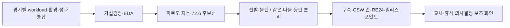
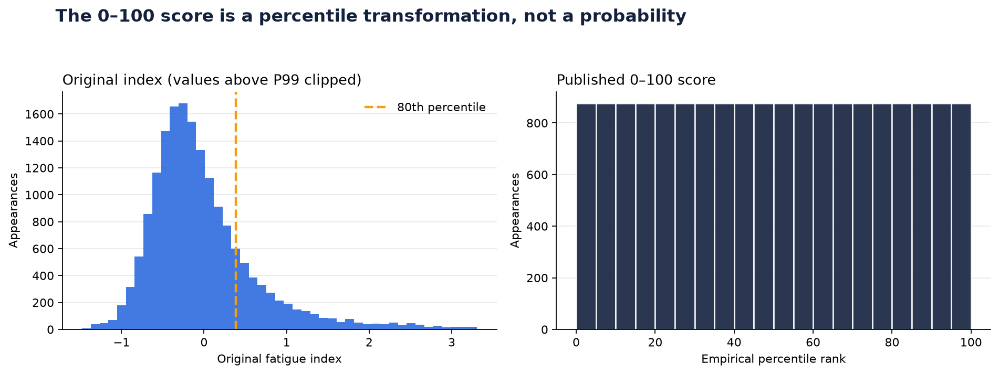
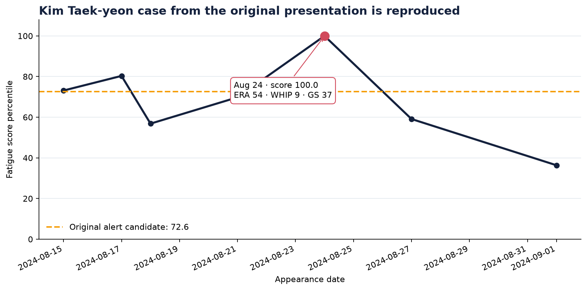
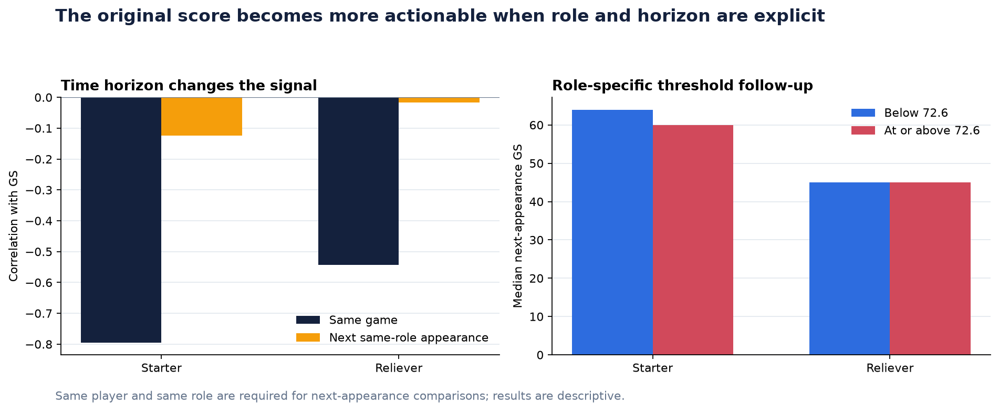
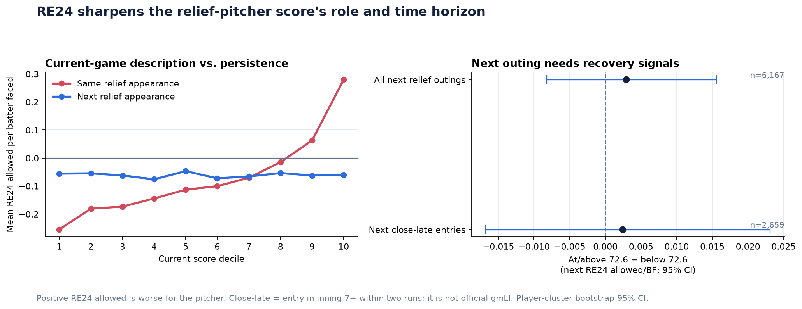
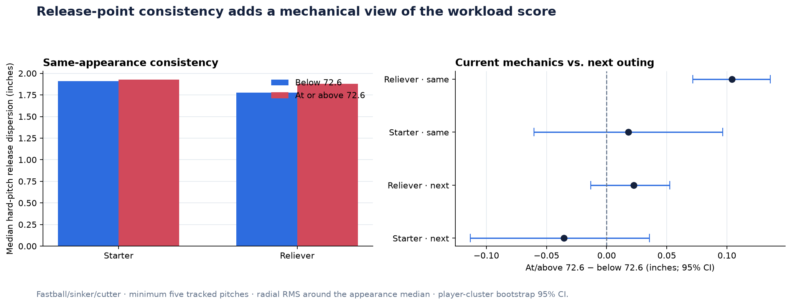

# KBO 투수 피로 신호와 교체 의사결정 분석

[](https://github.com/jinwon25/KBO-pitcher-fatigue/actions/workflows/ci.yml)

KBO 투수의 workload·회복 여건·경기 내 투구 변화를 하나의 점수와 보조 지표로 연결해, **언제 교체·휴식을 검토할지**를 설명한 야구 데이터 분석 프로젝트입니다.

제4회 중앙대학교 데이터 분석 학회 DArt-B 학술제에서 **대상**을 수상했으며, 발표에서 제시한 피로도 지수와 “역전점” 아이디어를 선발·불펜, 같은 경기·다음 등판, 구속·제구·릴리스 포인트까지 확장했습니다.

## 프로젝트 한눈에 보기

| 항목 | 내용 |
|---|---|
| 의사결정 문제 | 현장의 투수 교체·휴식 판단을 객관적 신호로 보조할 수 있는가? |
| 분석 단위 | 2020–2024 KBO 17,528등판·163명·선발/불펜 |
| 외부 확장 데이터 | 2023–2024 투구 단위 7,924등판 매칭 |
| 주요 기법 | EDA·가설검정·앙상블·SHAP·시계열 검증·RE24·cluster bootstrap |
| 산출물 | [분석 노트북](./notebooks/analysis.ipynb) · [모니터링 앱](./app/역전점_앱.py) · [학술제 발표자료](./docs/최강이세용_발표_자료.pdf) |
| 성과 | 제4회 DArt-B 학술제 대상 ([상장](./docs/상장.jpg)) |
| 본인 역할 | EDA·전처리·모델링·해석·시각화, 팀 기여도 40% |

## 핵심 결론과 활용 방식

| 분석 결론 | 관측 결과 | 의사결정 해석 |
|---|---|---|
| 피로도 지수는 당일 경기 상태를 요약 | 점수가 높을수록 FIP·ERA·WHIP 상승, GS 하락 | 경기 중 workload와 성과 악화를 함께 보는 모니터링 신호 |
| `72.6`은 추가 확인 구간 | 표본 약 상위 20% | 자동 교체선이 아니라 휴식·구속·제구를 함께 확인할 후보선 |
| 선발은 다음 등판까지 약한 신호가 존재 | 현재 점수–다음 선발 GS `r = −0.124`, 72.6 기준 중앙값 `64 → 60` | 선발 휴식·다음 등판 준비 점검의 보조 지표 |
| 불펜은 등판 맥락과 투구 메커닉이 중요 | 같은 등판 RE24/BF `−0.255 → +0.280`, 고점수 불펜의 릴리스 분산도 `+0.104 inch` | GS 대신 주자·아웃 상태와 릴리스 일관성을 함께 확인 |
| 다음 등판은 점수 하나로 예측하지 않음 | 다음 불펜 RE24/BF `r = −0.003`, 구간 차이 CI에 0 포함 | 회복·구위·상대타선을 추가한 다변량 판단이 필요 |

## 분석 설계



### 1. workload를 하나의 지수로 요약

투구 강도, 최근 구종 운용, 연투·휴식 상태를 결합했습니다.

```text
Fatigue Index
= 0.490 × z(NP/IP)
+ 0.098 × z(변화구 구사율)
+ 0.266 × z(혹사 정도)
+ 0.146 × z(누적 연투일수)
```

가중치는 RandomForest·XGBoost·LightGBM 스태킹으로 FIP를 모델링한 뒤 SHAP 중요도로 구성했습니다. 0–100 점수는 발생 확률이 아니라 전체 표본 내 상대적 백분위입니다.



### 2. 당일 성과와 사례 분석

점수가 높아질수록 같은 경기의 FIP·ERA·WHIP이 높아지고 GS가 낮아지는 패턴을 확인했습니다. 2024년 8월 24일 김택연 선수는 점수 `99.98`, ERA `54.00`, WHIP `9.00`으로 발표의 핵심 사례를 보여 줍니다.



이 관계는 점수 구성과 당일 성과가 겹치는 기술적 관계이므로, 피로가 성과 저하를 “유발했다”는 인과관계로 표현하지 않습니다.

### 3. 선발과 불펜, 당일과 다음 등판을 분리

선발은 현재 점수가 72.6 이상일 때 다음 선발 GS 중앙값이 `64→60`으로 낮았습니다. 2020–2022 학습, 2023 하이퍼파라미터 선택, 2024 테스트로 고정한 Ridge 기준 모델은 다음 선발 GS MAE `9.73`, R² `0.084`였고 과거 평균 기준선보다 MAE를 `4.3%` 개선했습니다.



### 4. 투구 과정과 불펜 맥락을 추가

CC BY 4.0 공개 PBP에서 강한 공 구속, 후반 구속 변화, CSW%, 존 통과율, 초구 스트라이크율을 파생했습니다. 정본과의 매칭률은 `97.5%`, 투구수 상관은 `0.9995`입니다.

불펜은 GS 대신 24개 주자·아웃 상태의 기대득점 변화를 사용한 RE24/BF로 비교했습니다. 같은 등판에서는 점수 구간에 따라 `−0.255→+0.280`으로 구분됐지만, 다음 등판에서는 상관 `−0.003`으로 유지되지 않았습니다.



### 5. 릴리스 포인트로 메커닉 일관성을 확인

직구·투심·커터가 5구 이상 추적된 등판에서 중앙 릴리스 포인트로부터의 방사형 RMS 거리를 계산했습니다. 불펜은 72.6 이상 구간에서 당일 분산도가 `+0.104 inch` 높았고 95% CI는 `+0.072~+0.136`으로 0을 포함하지 않았습니다. 다음 불펜 등판의 차이는 `+0.023 inch`, 95% CI `−0.013~+0.053`으로 작았습니다.



이 결과는 생리적 피로의 직접 측정이 아니라, 당일 점수와 투구 메커닉 일관성을 함께 볼 수 있는 모니터링 신호입니다.

## 의사결정 화면

Streamlit 앱은 두 투수의 점수 추이를 비교하고, 특정 등판의 workload·성과·구속·CSW·존·RE24·릴리스 일관성을 함께 보여 줍니다. 또한 같은 경기와 다음 등판을 구분해 당일 상태 설명과 미래 예측을 혼동하지 않도록 설계했습니다.

```bash
python -m streamlit run app/역전점_앱.py
```

## 제안하는 활용 원칙

1. `72.6`을 자동 교체 규칙이 아니라 **추가 점검 트리거**로 사용합니다.
2. 선발은 휴식일·최근 workload·다음 GS를, 불펜은 진입 상황·RE24·릴리스 일관성을 함께 확인합니다.
3. 당일 상태와 다음 등판 예측을 분리하고, 회복·부상 확률로 표현하지 않습니다.
4. 점수보다 현장 코치·트레이너의 관찰을 우선하는 **의사결정 보조 도구**로 사용합니다.

## 프로젝트에서 보여 준 역량

- 야구 도메인을 반영한 지표 정의와 선발/불펜 분리
- 여러 출처의 경기별·선수별·투구별 데이터 통합
- 설명 관계와 미래 예측, 상관과 인과를 구분하는 분석 해석
- 시간 순서 기반 학습/검증과 선수 단위 bootstrap 불확실성 보고
- 분석 결과를 실제 선수 비교 화면으로 전환하는 스토리텔링

## 바로 보기

- [실행 결과가 저장된 분석 노트북](./notebooks/analysis.ipynb)
- [학술제 발표 자료](./docs/최강이세용_발표_자료.pdf)
- [학술제 프로젝트 요약서](./docs/최강이세용_프로젝트_요약서.pdf)
- [분석 방법과 지표 정의](./docs/METHODOLOGY.md)
- [공개 PBP 출처·라이선스](./data/external/README.md)
- [핵심 수치·검증 결과](./reports/metrics.json)

## 데이터 범위와 해석 제한

- 현재 점수는 생리적 피로나 부상 확률의 직접 측정치가 아닙니다.
- 실제 부상·회복·트레이닝 라벨이 없어 점수만으로 자동 교체나 부상 예측을 하지 않습니다.
- 로컬 2025 자료는 7월 10일까지의 부분 시즌이고 더블헤더 경기 ID가 없어 외부 시즌 검증에서 제외했습니다.
- 7회 이후 2점차 이내 진입은 투명한 상황 필터이며, 승리확률 기반 공식 gmLI로 표현하지 않습니다.

## 프로젝트 실행

Python 3.11 기준입니다. 상세 데이터 생성 방법은 [데이터 안내](./data/README.md)와 [PBP 안내](./data/external/README.md)에 분리했습니다.

```bash
python -m venv .venv
source .venv/bin/activate
pip install -r requirements-dev.txt
make check
```

`make check`는 테스트, 보고서·차트 생성, 데이터 검증, 노트북 전체 실행을 수행합니다.

## 라이선스와 팀

학술제 분석은 강경희, 강세범, 이정연, 조용호, 최진원의 5인 팀 프로젝트입니다. 코드는 [MIT License](./LICENSE)를 따르며 원천 데이터 권리는 각 제공처에 있습니다.

---

최진원 · [GitHub](https://github.com/jinwon25)
