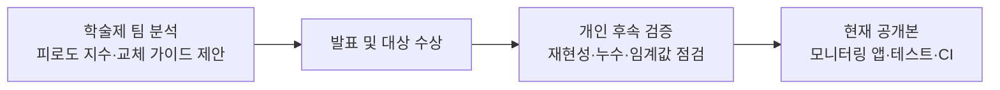
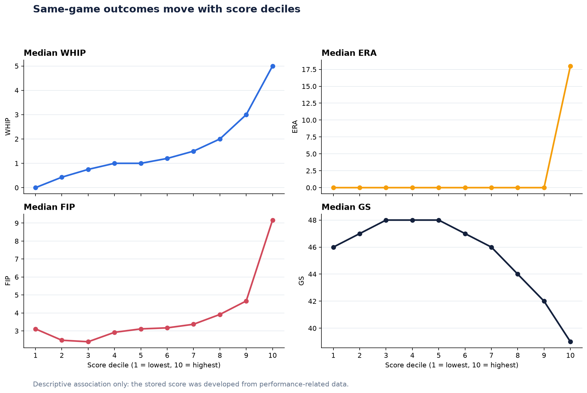
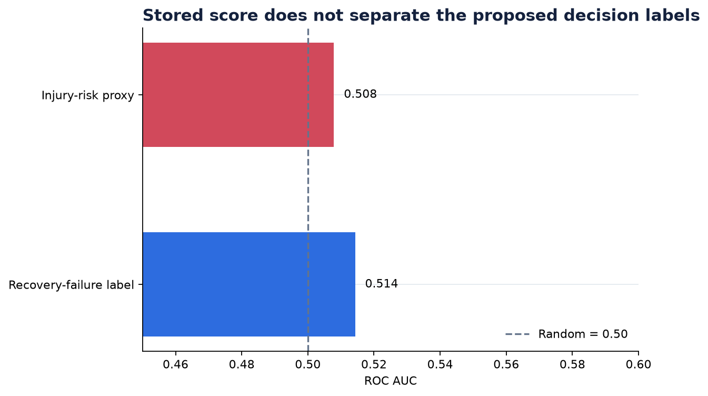

# KBO 투수 피로도 지수와 교체 의사결정 지원

[](https://github.com/jinwon25/KBO-pitcher-fatigue/actions/workflows/ci.yml)

제4회 중앙대학교 데이터 분석 학회 DArt-B 학술제 대상 수상 분석과, 이후 개인적으로 수행한 재현성 검증·고도화 작업을 함께 기록한 프로젝트입니다.

학술제에서는 투수의 누적 부담을 수치화하고 교체 판단을 보조하는 방법을 제안했습니다. 후속 작업에서는 이 문제의식을 그대로 유지하면서 공개 코드와 데이터의 재현성, 점수 해석, 목표 누수, 임계값의 활용 가능성을 다시 점검했습니다. 원 분석을 지우는 대신 **당시의 분석 성과와 이후의 학습·개선 과정을 구분해 보여 주는 것**이 이 저장소의 목적입니다.



## 프로젝트 한눈에 보기

| 항목 | 내용 |
|---|---|
| 원 프로젝트 | KBO 투수 피로도 지수 설계와 교체 의사결정 가이드 제안 |
| 진행 기간 | 학술제 분석 2025.04~2025.05 · 개인 후속 검증 2026 |
| 팀 | 중앙대학교 데이터 분석 학회 DArt-B 5기 “최강이세용”, 5인 |
| 본인 역할 | EDA · 데이터 전처리 · 모델링 · 결과 해석 및 시각화 (기여도 40%) |
| 수상 | 제4회 DArt-B 학술제 대상 ([상장](./docs/상장.jpg)) |
| 현재 정본 범위 | 2020-05-05~2024-10-01 · 17,528행 · 163명 · 선발/불펜 |
| 현재 산출물 | [후속 분석 노트북](./notebooks/analysis.ipynb) · [모니터링 앱](./app/역전점_앱.py) · [검증 지표](./reports/metrics.json) |

## 학술제에서 수행한 분석

당시 팀은 “투수 교체가 감독의 경험과 직관에 크게 의존하는 상황에서, 경기 기록으로 피로 누적과 교체 판단을 정량화할 수 있는가?”를 핵심 질문으로 삼았습니다.

### 분석 흐름

1. MYKBO·스탯티즈·KBO 공식 사이트·기상 정보에서 경기, 선수, 구속, 이동, 환경 데이터를 수집했습니다.
2. 누적 이닝, 체감온도, 연투, 신체 조건과 경기력·부상 위험 간 차이를 가설 검정으로 탐색했습니다.
3. NP/IP, 최근 구종 구사율, 혹사 정도, 누적 연투 관련 변수를 결합해 피로도 지수를 설계했습니다.
4. RandomForest·XGBoost·LightGBM과 SHAP을 활용해 변수 중요도와 가중치를 탐색했습니다.
5. 피로도 구간과 회복/부상 대리 지표를 이용해 교체 경고 임계값을 제안했습니다.
6. 두 투수의 환경·기량·신체 조건과 피로도를 비교하는 역전점 시뮬레이터를 구현했습니다.

### 당시 발표한 결과

- 0–100 스케일의 피로도 지수를 제안했습니다.
- 피로도와 WHIP·ERA·FIP·GS의 관계를 분석해 피로 증가 구간에서 경기력 저하 패턴을 보고했습니다.
- 피로도 `72.6`을 교체·휴식 검토 후보 임계값으로 제안했습니다.
- 두 투수의 예상 경기력 교차점을 보여 주는 Streamlit 시뮬레이터를 발표했습니다.

이 결과는 학술제 당시의 분석 설계와 발표 맥락을 나타냅니다. 원 발표 자료, 프로젝트 요약서, 노트북과 당시 코드 상태는 아래에서 그대로 확인할 수 있습니다.

- [학술제 분석 상세 기록](./docs/ORIGINAL_PROJECT.md)
- [원 발표 자료](./docs/최강이세용_발표_자료.pdf)
- [원 프로젝트 요약서](./docs/최강이세용_프로젝트_요약서.pdf)
- [후속 정리 전 코드 스냅샷](https://github.com/jinwon25/KBO-pitcher-fatigue/tree/982f3c7)

## 개인 후속 검증과 고도화

발표 이후 실제 서비스나 현업 의사결정에 적용하려면 “점수가 높다”는 사실보다 **어떤 모집단에서 만든 값인지, 미래 결과를 예측하는지, 임계값이 다른 시즌에도 유지되는지**가 더 중요하다는 한계를 느꼈습니다. 이에 원 주제를 유지한 채 다음을 보완했습니다.

| 원 분석 요소 | 후속 작업에서의 처리 |
|---|---|
| 투수 피로와 교체 판단을 정량화하려는 문제의식 | 유지 |
| 경기·workload·휴식 관련 데이터 | 유지하고 데이터 계약 추가 |
| 0–100 피로도 지수 | 산출값을 보존하고 백분위 점수로 해석을 명확화 |
| 72.6 임계값 | 학술제 결과로 기록하되 현재 운영 규칙에서는 적용 보류 |
| 역전점 시뮬레이터 | 아이디어와 원본 기록은 보존하고, 현재 앱에서는 누수 모델과 자동 추천 제거 |
| 모델 평가 | 동일 표본 상관 외에 AUC, 선수 내 상관, 재현성 테스트 추가 |

### 1. 점수의 의미를 다시 정의했다

최종 데이터의 `피로도지수_점수`는 `피로도지수`를 전체 17,528행에서 순위화한 백분위 값과 오차 `1e-14` 이내로 일치합니다. 따라서 80점은 “부상 확률 80%”가 아니라 **현재 표본에서 원점수가 상위 20%**라는 뜻입니다.


### 2. 성과와의 관계는 재현되지만 기술적 연관으로 해석했다

원점수의 행 단위 피어슨 상관은 WHIP `0.834`, ERA `0.637`, FIP `0.482`, GS `−0.389`로 확인됩니다. 학술제에서 관찰한 “높은 점수 구간의 경기력 저하” 방향은 다시 확인됐습니다.

다만 점수 개발 과정에서 경기력 관련 결과가 사용됐고 같은 표본에서 관계를 평가했으므로, 현재는 이를 미래 예측력이나 피로의 인과효과가 아닌 **동일 경기 내 기술적 관계**로 제한해 해석합니다.



### 3. 임계값은 후속 검증 대상으로 남겼다

저장된 데이터로 재계산한 ROC AUC는 회복실패 라벨 `0.514`, 과거 노트북에서 사용한 부상 대리 라벨 `0.508`입니다. 모두 무작위 기준 `0.5`에 가까웠습니다. 또한 설명에 적힌 타깃과 실제 Decision Tree 셀의 타깃, 저장된 원점수 임계값과 발표 점수 `72.6` 사이에 차이가 있었습니다.

따라서 `72.6`은 **학술제에서 제안한 탐색적 기준**으로 기록하되, 별도 시즌·실제 회복/부상 라벨로 재검증하기 전에는 자동 교체 규칙으로 사용하지 않습니다.



상세한 계산 근거는 [개인 후속 검증 방법론](./docs/METHODOLOGY.md)에 정리했습니다.

## 현재 앱

현재 앱은 원 프로젝트의 “감독의 판단을 데이터로 보조한다”는 방향을 이어 갑니다. 두 투수의 점수 흐름과 특정 등판의 투구수·휴식일수·성과를 함께 볼 수 있지만, 검증되지 않은 자동 기용 추천은 하지 않습니다.

```bash
python -m streamlit run app/역전점_앱.py
```

파일명은 원 프로젝트 링크와의 호환을 위해 유지했습니다. 원 역전점 모델의 흐름은 발표 자료, 기존 노트북, [후속 정리 전 스냅샷](https://github.com/jinwon25/KBO-pitcher-fatigue/tree/982f3c7)에서 확인할 수 있습니다.

## 재현 방법

Python 3.11 기준입니다.

```bash
python -m venv .venv
source .venv/bin/activate
pip install -r requirements-dev.txt
make check
```

`make check`는 다음을 수행합니다.

1. 데이터 계약과 핵심 수치 테스트
2. 표·그림·`metrics.json` 재생성
3. 링크와 대표 노트북 무결성 검사
4. 대표 노트북 전체 실행
5. Streamlit 앱 기동 테스트

앱만 실행할 때는 `requirements.txt`로 충분합니다. 학술제 당시 노트북이나 크롤러를 추가로 실행하려면 `requirements-legacy.txt`가 필요합니다.

## 저장소 구조

```text
KBO-pitcher-fatigue/
├── app/                    # 후속 검증 기반 Streamlit 모니터링 앱
├── kbo_fatigue/            # 로딩·요약·평가 함수
├── scripts/                # 리포트 생성 및 저장소 검사
├── tests/                  # 데이터 계약·핵심 결과·앱 테스트
├── notebooks/
│   ├── analysis.ipynb      # 개인 후속 검증 노트북
│   └── 00~05_*.ipynb      # 학술제 당시 분석 과정
├── data/
│   ├── final/              # 현재 분석 정본
│   ├── processed/          # 학술제 당시 중간 산출물
│   └── raw/                # 수집 원본
├── reports/                # 후속 검증에서 재생성한 지표·그림
└── docs/                   # 원 프로젝트와 후속 검증 문서·발표 자료
```

## 데이터와 산출물

- [데이터 범위와 lineage](./data/README.md)
- [후속 분석 노트북](./notebooks/analysis.ipynb)
- [학술제 노트북 안내](./notebooks/README.md)
- [수집 코드 안내](./crawlers/README.md)
- [학술제 분석 상세 기록](./docs/ORIGINAL_PROJECT.md)
- [개인 후속 검증 방법론](./docs/METHODOLOGY.md)

## 현재 한계와 다음 단계

- 피로도 원점수를 처음부터 다시 생성하는 하나의 확정된 파이프라인을 복원해야 합니다.
- `부상위험도`는 58.7%가 결측이며 실제 부상 발생 라벨로 검증되지 않았습니다.
- 다음 모델은 예측 시점 이전에 알 수 있는 workload-only 피처로 구성해야 합니다.
- 2020–2023년 학습, 2024년 테스트처럼 시간 순서를 보존하고 선수 단위 그룹 검증을 병행해야 합니다.
- 외부 시즌과 실제 회복·부상 라벨에서 calibration과 임계값 안정성을 확인해야 합니다.

## 팀과 라이선스

학술제 분석은 강경희, 강세범, 이정연, 조용호, 최진원의 5인 팀 프로젝트이며, 개인 후속 검증과 저장소 정리는 최진원이 수행했습니다.

코드는 [MIT License](./LICENSE)를 따릅니다. 원천 데이터의 권리는 각 제공처에 있으며, 재배포·상업적 사용 전 해당 제공처 정책을 별도로 확인해야 합니다.
